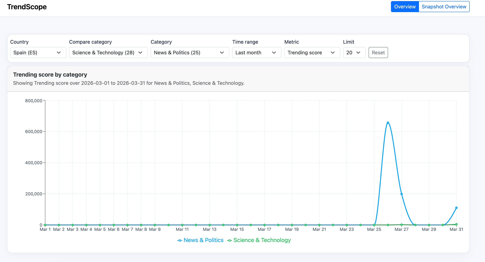
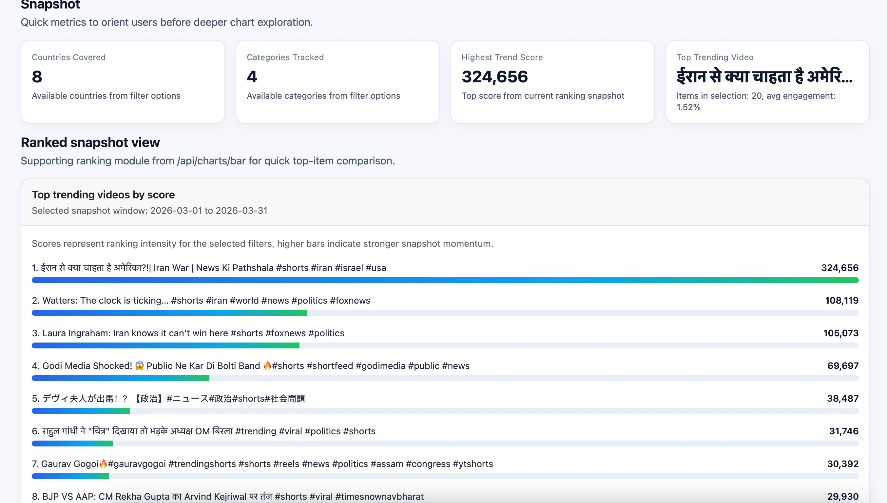

# Technical Project Description for TrendScope Analytics Frontend

The TrendScope Analytics Frontend is a web-based data visualization application for exploring YouTube trend signals across countries, categories, and time windows.  
The frontend is built with React, TypeScript, Bootstrap, and Recharts, and connects to a backend API for filters, trend snapshots, ranking charts, and time-series analysis.

The application currently includes two user-facing analysis views in the main dashboard:

- **Overview**: a compact filter toolbar plus time-series trend visualization.
- **Snapshot Overview**: quick KPI metrics and ranked snapshot comparison.

It also includes a **Dev Test** route for backend connectivity and payload inspection during development.

## Table of Contents

- [User-Interactive Features](#user-interactive-features)
- [Getting Started with Vite](#getting-started-with-vite)
- [Available Scripts](#available-scripts)
- [Backend Connectivity](#backend-connectivity)
- [Project Structure](#project-structure)

## User-Interactive Features

### Overview (Filter + Time-Series Analysis)



- Compact one-row filter controls:
  - Country
  - Compare Category
  - Category
  - Time Range
  - Metric
  - Limit
- Time-series chart powered by `/api/charts/timeseries`
- Fast filter-driven updates using TanStack Query caching

### Snapshot Overview (KPI + Ranking)



- Snapshot KPI cards for quick orientation
- Ranked snapshot view powered by `/api/charts/bar`
- Side-by-side support for top-item comparison in the selected window

### Dev Test Page

- API health and connectivity checks
- Raw JSON previews for filters/trends/charts payloads
- Useful for backend contract validation while iterating on UI

## Getting Started with Vite

This project was bootstrapped with Vite + React + TypeScript.

### Prerequisites

- Node.js 18+
- npm

### Installation

```bash
npm install
```

### Run in Development

```bash
npm run dev
```

Open the local URL printed in terminal .

## Available Scripts

In the project directory, you can run:

### `npm run dev`

Runs the app in development mode with hot reload.

### `npm run build`

Builds the app for production into the `dist` folder with optimized assets.

### `npm run lint`

Runs ESLint checks for TypeScript/React code quality rules.

### `npm run preview`

Serves the production build locally for verification.

## Backend Connectivity

- Default backend base URL: `{base URL}`
- Optional override: set `VITE_API_BASE_URL` in `.env`

Core API endpoints used by this frontend:

- `GET /api/health/db`
- `GET /api/filters`
- `GET /api/trends`
- `GET /api/charts/bar`
- `GET /api/charts/timeseries`

Example `.env`:

```bash
VITE_API_BASE_URL=`{base URL}`
```

## Project Structure

- `src/api/`: Axios client, endpoint methods, shared API types
- `src/hooks/`: TanStack Query data hooks and query keys
- `src/components/`: layout, showcase modules, reusable UI blocks
- `src/pages/`: route-level pages (`AnalyticsShowcasePage`, `TestConnectionPage`)
- `src/routes/`: router and path definitions
- `src/app/`: app shell and providers
